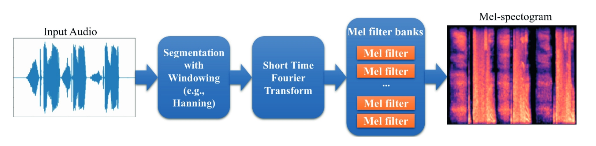
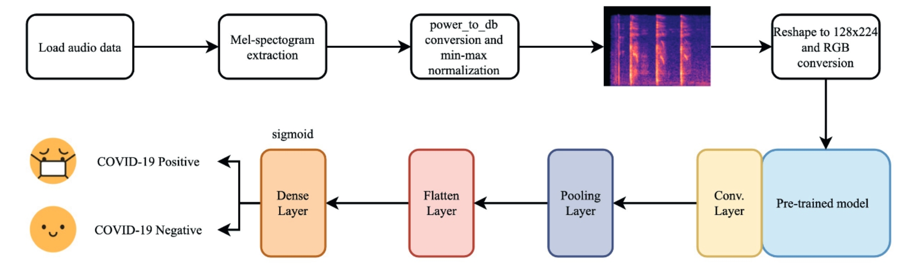

## An example transfer learning approach to cough audio data classification using transfer learning

This example is the part of the below work. Please cite you if find it useful:

[Akgun, D., et al. "A transfer learning-based deep learning approach for automated COVID-19diagnosis with audio data." Turkish Journal of Electrical Engineering and Computer Sciences 29.8 (2021): 2807-2823](https://journals.tubitak.gov.tr/elektrik/vol29/iss8/15/)

@article{akgun2021transfer,
  title={A transfer learning-based deep learning approach for automated COVID-19diagnosis with audio data},
  author={AKG{\"U}N, DEVR{\.I}M and KABAKU{\c{S}}, ABDULLAH TALHA and {\c{S}}ENT{\"U}RK, ZEHRA KARAPINAR and {\c{S}}ENT{\"U}RK, ARAFAT and K{\"U}{\c{C}}{\"U}KK{\"U}LAHLI, ENVER},
  journal={Turkish Journal of Electrical Engineering and Computer Sciences},
  volume={29},
  number={8},
  pages={2807--2823},
  year={2021}
}

## Converting audio data to image using Melspectogram:

## Training system:

# Example results
Batch size= 4   Learning rate= 0.005  Acc= [0.8695652  0.8913044  0.82417583 0.84615386 0.83516484] Average= 0.8532728  num_iters= 184

Batch size= 4   Learning rate= 0.001  Acc= [0.8695652  0.9130435  0.82417583 0.83516484 0.82417583] Average= 0.85322505  num_iters= 149

Batch size= 4   Learning rate= 0.0005  Acc= [0.8804348  0.90217394 0.84615386 0.85714287 0.82417583] Average= 0.8620163  num_iters= 109

Batch size= 4   Learning rate= 0.0001  Acc= [0.8804348  0.9130435  0.83516484 0.82417583 0.84615386] Average= 0.8597945  num_iters= 146

Batch size= 8   Learning rate= 0.005  Acc= [0.8863636  0.90909094 0.84090906 0.85227275 0.8863636 ] Average= 0.875  num_iters= 300

Batch size= 8   Learning rate= 0.001  Acc= [0.875      0.89772725 0.82954544 0.82954544 0.85227275] Average= 0.8568182  num_iters= 187

Batch size= 8   Learning rate= 0.0005  Acc= [0.89772725 0.90909094 0.84090906 0.84090906 0.85227275] Average= 0.8681818  num_iters= 224

Batch size= 8   Learning rate= 0.0001  Acc= [0.89772725 0.89772725 0.85227275 0.85227275 0.8636364 ] Average= 0.8727273  num_iters= 110

Batch size= 16   Learning rate= 0.005  Acc= [0.8875 0.9125 0.85   0.8625 0.875 ] Average= 0.87749994  num_iters= 295

Batch size= 16   Learning rate= 0.001  Acc= [0.8875 0.9125 0.85   0.8375 0.8375] Average= 0.86500007  num_iters= 158

Batch size= 16   Learning rate= 0.0005  Acc= [0.8625 0.925  0.8625 0.85   0.8375] Average= 0.8675  num_iters= 126

Batch size= 16   Learning rate= 0.0001  Acc= [0.9    0.925  0.85   0.85   0.8625] Average= 0.87750006  num_iters= 227

Batch size= 32   Learning rate= 0.005  Acc= [0.90625  0.90625  0.890625 0.875    0.859375] Average= 0.8875  num_iters= 160

Batch size= 32   Learning rate= 0.001  Acc= [0.890625 0.9375   0.875    0.859375 0.859375] Average= 0.884375  num_iters= 176

Batch size= 32   Learning rate= 0.0005  Acc= [0.875    0.9375   0.875    0.875    0.890625] Average= 0.890625  num_iters= 184

Batch size= 32   Learning rate= 0.0001  Acc= [0.90625 0.9375  0.875   0.84375 0.875  ] Average= 0.8875  num_iters= 139

Batch size= 64   Learning rate= 0.005  Acc= [0.875    0.921875 0.90625  0.859375 0.890625] Average= 0.890625  num_iters= 205

Batch size= 64   Learning rate= 0.001  Acc= [0.90625  0.90625  0.90625  0.828125 0.890625] Average= 0.8875  num_iters= 218

Batch size= 64   Learning rate= 0.0005  Acc= [0.90625  0.921875 0.90625  0.828125 0.859375] Average= 0.884375  num_iters= 208

Batch size= 64   Learning rate= 0.0001  Acc= [0.890625 0.9375   0.890625 0.875    0.890625] Average= 0.896875  num_iters= 300

